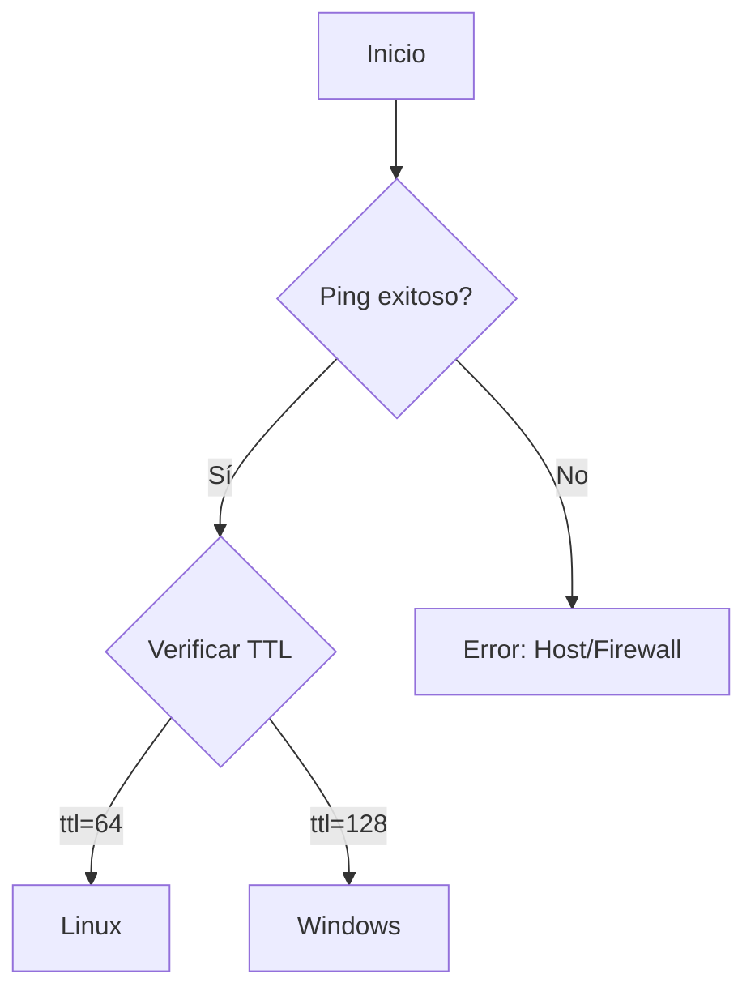

### **Explicación General**

El objetivo de estos scripts es realizar un ping a una dirección IP dada y, dependiendo del valor TTL (Time To Live) en la respuesta, determinar si el sistema operativo del host es Linux o Windows. Los valores típicos de TTL son:

- **Linux**: TTL=64.
- **Windows**: TTL=128.

---
# Ojo

**Limitaciones Clave a Considerar**:  

⚠️ **Firewalls en Windows**: 

Si el equipo Windows tiene el firewall activado (configuración predeterminada), **bloqueará las solicitudes ICMP** (ping), resultando en:

- **Paquetes perdidos** (`Request timed out`)  
- **Imposibilidad de detectar el TTL**  
- Falsos negativos en la identificación del OS

### **Consecuencias del Firewall Activo**

| Escenario              | Comportamiento del Script        |
| ---------------------- | -------------------------------- |
| Firewall OFF + Windows | Detecta `ttl=128` correctamente  |
| Firewall ON + Windows  | Muestra error (no hay respuesta) |
| Firewall ON + Linux    | Error (si bloquea ICMP en Linux) |

---

### **Flujo del Script con Firewall Activo**  



### **Primera parte: Script básico**

```bash
ping -c 1 192.168.0.111 > ping.log
grep ttl=64 ping.log -c
grep ttl=128 ping.log -c
```

#### **Paso a paso:**

1. `ping -c 1 192.168.0.111 > ping.log`:
    
    - Ejecuta un ping a la dirección IP `192.168.0.111` con un solo paquete (`-c 1`).
    - La salida del comando se redirige al archivo `ping.log`.
    
1. `grep ttl=64 ping.log -c`:
    
    - Busca en `ping.log` si hay alguna línea con `ttl=64`.
    - Devuelve el número de coincidencias.
    
1. `grep ttl=128 ping.log -c`:
    
    - Busca en `ping.log` si hay alguna línea con `ttl=128`.
    - Devuelve el número de coincidencias.

**Propósito**: Determinar si el sistema operativo es Linux (TTL=64) o Windows (TTL=128).

---

### **Segunda parte: Script con condicionales**

```bash
#!/bin/bash

host=10.12.49.117 

echo "Vamos a hacer un ping a la ip: $host"

ping -c 1 $host > ping.log

if test $(grep ttl=64 ping.log -c) = 1; then
         echo "Se trata de un Linux"
elif test $(grep ttl=128 ping.log -c) =1; then
         echo "Se trata de un Windows"
fi
```

#### **Paso a paso:**

1. `host=10.12.49.117`: Define la dirección IP que se quiere analizar.
2. `echo "Vamos a hacer un ping a la ip: $host"`: Muestra un mensaje indicando el inicio del proceso.
3. `ping -c 1 $host > ping.log`: Ejecuta el ping a la IP almacenada en la variable `host`, guardando la salida en `ping.log`.
4. `if test $(grep ttl=64 ping.log -c) = 1; then`:
    - Verifica si el archivo contiene exactamente una coincidencia con `ttl=64`.
    - Si es así, imprime `Se trata de un Linux`.
5. `elif test $(grep ttl=128 ping.log -c) = 1; then`:
    - Verifica si hay una coincidencia con `ttl=128`.
    - Si es así, imprime `Se trata de un Windows`.

---

### **Tercera parte: Script con entrada interactiva**

```bash
#!/bin/bash

read -p "Ingresa una direccion ip: " host  

echo "Vamos a hacer un ping a la IP: $host"

ping -c 1 $host > ping.log

if grep -q "ttl=64" ping.log; then
    echo "Se trata de un Linux"
elif grep -q "ttl=128" ping.log; then
    echo "Se trata de un Windows"
else
    echo "No se pudo determinar el sistema operativo o el host no está accesible."
fi
```

#### **Paso a paso:**

1. `read -p "Ingresa una direccion ip: " host`: Solicita al usuario ingresar la IP que se quiere analizar y la almacena en la variable `host`.
2. `echo "Vamos a hacer un ping a la IP: $host"`: Muestra un mensaje indicando que se realizará el ping.
3. `ping -c 1 $host > ping.log`: Ejecuta el ping y guarda la salida en el archivo `ping.log`.
4. `if grep -q "ttl=64" ping.log; then`:
    - Verifica si hay una coincidencia con `ttl=64` en el archivo.
    - Si es así, imprime `Se trata de un Linux`.
5. `elif grep -q "ttl=128" ping.log; then`:
    - Verifica si hay una coincidencia con `ttl=128`.
    - Si es así, imprime `Se trata de un Windows`.
6. `else`:
    - Si no encuentra TTL=64 ni TTL=128, imprime que no pudo determinarse el sistema operativo o que el host no está accesible.

---

**Recuerda que**:

- Cuando una máquina Windows o SO tiene el firewall activado, podría bloquear las solicitudes ICMP (que es el protocolo utilizado por `ping`), haciendo que no se reciba ninguna respuesta.
- Esto puede provocar que el script no determine correctamente el sistema operativo o indique que el host no está accesible.

### **Conclusión**

Estos scripts son ejemplos básicos de cómo usar herramientas de red (como `ping`) y comandos de análisis de texto (`grep`) para identificar información de un sistema remoto de manera sencilla. 
