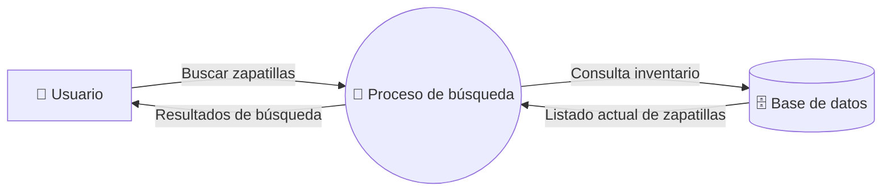
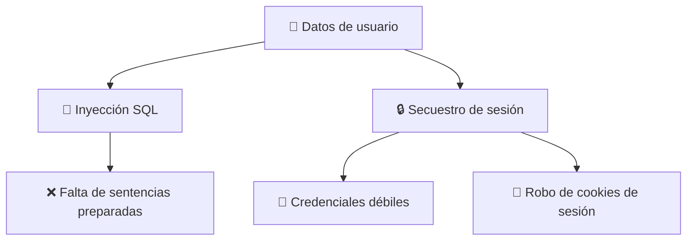

# 🛡️ Actividad: Modelado de amenazas con PASTA

**Escenario:** Empresa de zapatillas lanzando una aplicación móvil de compra/venta para entusiastas y coleccionistas.

---

## I. Definir objetivos de negocio y seguridad

- La app debe **conectar compradores y vendedores de forma fluida**.
    
- La **privacidad de los datos** es prioritaria para que los usuarios confíen en la plataforma.
    
- Se requiere **gestión segura de pagos** para evitar problemas legales.
    
- Debe incluir opciones de mensajería y calificación de vendedores.
    

---

## II. Definir el alcance técnico

**Tecnologías clave:**

- API
    
- PKI (RSA y AES)
    
- SHA-256
    
- SQL
    

**Prioridad:** Se evaluará primero **SQL**, ya que gestiona inventario, cuentas y transacciones.  
👉 Una base de datos mal protegida puede exponer **información sensible** (usuarios, credenciales, pagos) y ser vulnerable a **inyecciones SQL**.

---

## III. Descomponer la aplicación

**Proceso ejemplo (diagrama de flujo de datos):**

- Usuario busca zapatillas → **Proceso de búsqueda de producto** → Consulta en **base de datos** → Listado de inventario.
    
- Puntos críticos: validación de entradas, protección de contraseñas (hash), cifrado en tránsito (TLS/PKI).
    

---

## IV. Análisis de amenazas

- **Amenaza interna:** empleado malicioso con acceso privilegiado que manipule la base de datos.
    
- **Amenaza externa:** atacante explotando inyección SQL o robo de credenciales.
    

---

## V. Análisis de vulnerabilidades

- **Código vulnerable:** formularios de login y pago sin sanitización de entradas → riesgo de **SQLi**.
    
- **Base de datos débil:** credenciales almacenadas sin hash robusto → riesgo de fuga de datos.
    

---

## VI. Modelado de ataques

**Árbol de ataque (ejemplo simplificado):**

🎯 **Objetivo:** datos de usuario (cuentas, pagos).

- **Vector 1: Inyección SQL**
    
    - Falta de sentencias preparadas.
        
- **Vector 2: Secuestro de sesión**
    
    - Credenciales débiles → robo de cookies.
        

---

## VII. Análisis de riesgo e impacto

**Controles de seguridad recomendados:**

1. Uso de **sentencias preparadas** en SQL para prevenir inyección.
    
2. Implementación de **MFA (autenticación multifactor)**.
    
3. Cifrado de datos sensibles con **AES y RSA** en tránsito y reposo.
    
4. **Hash seguro con SHA-256 + salting** para credenciales.
    

---

✅ Con este ejercicio, la empresa puede lanzar su app con mayor confianza, reduciendo la exposición a riesgos críticos como robo de datos, fraude en pagos y secuestro de sesiones.

---

# 🛡️ Tabla PASTA – Empresa de Zapatillas

|**Etapa**|**Resultados / Notas**|
|---|---|
|**I. Definir objetivos de negocio y seguridad**|- Conectar compradores y vendedores de forma fluida.- Privacidad de datos como prioridad.- Procesamiento seguro de pagos para evitar problemas legales.- Funciones de mensajería y calificación de vendedores.|
|**II. Definir el alcance técnico**|Tecnologías: API, PKI (RSA/AES), SHA-256, SQL.**Prioridad:** SQL → gestiona inventario, cuentas y transacciones.Riesgo: inyección SQL y fuga de datos sensibles.|
|**III. Descomponer la aplicación**|Flujo de datos:- Usuario busca zapatillas → Proceso de búsqueda → Base de datos.- Puntos críticos: validación de entradas, cifrado en tránsito (TLS), almacenamiento seguro de contraseñas.|
|**IV. Análisis de amenazas**|- **Interna:** empleado con acceso privilegiado que manipule la BD.- **Externa:** atacante explotando SQLi o robo de credenciales.|
|**V. Análisis de vulnerabilidades**|- Formularios vulnerables sin sanitización → riesgo de SQLi.- Almacenamiento de credenciales sin hash robusto.- Posibles fallos en la gestión de sesiones.|
|**VI. Modelado de ataques**|🎯 **Objetivo:** datos de usuarios (cuentas, pagos).- Vector 1: **Inyección SQL** (falta de sentencias preparadas).- Vector 2: **Secuestro de sesión** (credenciales débiles, robo de cookies).|
|**VII. Análisis de riesgo e impacto**|**Controles de seguridad:**1. Sentencias preparadas en SQL.2. Autenticación multifactor (MFA).3. Cifrado AES/RSA en tránsito y reposo.4. Hash SHA-256 con salting para credenciales.|

---

## 📊 Diagrama de flujo de datos (DFD)

---

## 🌳 Árbol de ataque (Attack Tree)

---

