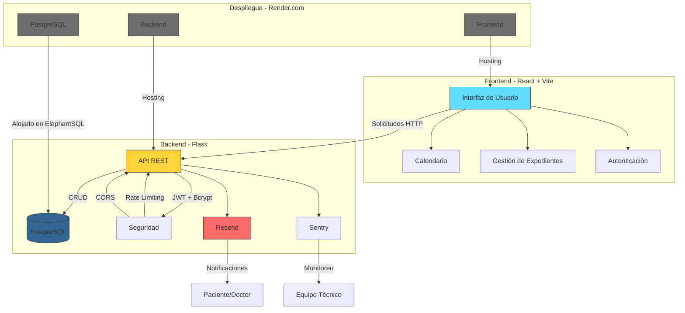
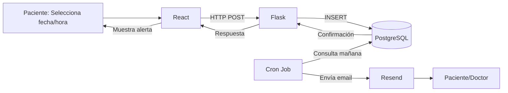

---
# Sistema de Gestión de Citas para Hospitales y Clínicas

Tecnología Utilizada: El sistema se construirá utilizando **Flask (Python)** como backend para garantizar modularidad y adaptabilidad. La base de datos **PostgreSQL**, alojada en **ElephantSQL**, será la encargada de almacenar y gestionar datos críticos como citas médicas, historiales de pacientes y registros clínicos. Para la interfaz de usuario, se empleará **React + Vite**, asegurando rapidez y eficiencia en la experiencia del usuario. Además, se integrará **react-big-calendar** para la gestión visual de citas. La autenticación se implementará con **JWT + Bcrypt**, proporcionando seguridad en el manejo de credenciales y sesiones. Para las notificaciones, se utilizará **Resend** para el envío de correos electrónicos. El monitoreo de errores en producción podrá ser gestionado con **Sentry** (opcional). Finalmente, todo el sistema será desplegado en **Render.com**, una plataforma que permite gestionar React, Flask y PostgreSQL sin configuraciones complejas, garantizando escalabilidad y facilidad de mantenimiento.

### **Stack Tecnológico Actualizado** 🛠️  

| **Componente**     | **Tecnología**        | **Razón**                                                                      |
| ------------------ | --------------------- | ------------------------------------------------------------------------------ |
| **Frontend**       | React + Vite          | Ligero y rápido. Usa `react-big-calendar` para gestión visual de citas.        |
| **Backend**        | Flask (Python)        | Flexible y fácil de aprender. Ideal para APIs REST.                            |
| **Base de Datos**  | **PostgreSQL**        | Escalable desde el inicio. Usa **ElephantSQL** (PostgreSQL gratis en la nube). |
| **Autenticación**  | **JWT + Bcrypt**      | Contraseñas encriptadas y tokens seguros con expiración.                       |
| **Notificaciones** | Resend (Email)        | API fácil y gratuita para emails.                                              |
| **Logs/Errores**   | **Sentry (opcional)** | Monitoreo proactivo de errores en producción.                                  |
| **Despliegue**     | Render.com            | Soporta PostgreSQL, Flask y React sin configuración compleja.                  |

Flujo de trabajo:

### **Leyenda de Componentes** 🧱  

| **Elemento**              | **Descripción**                                                                 |
| ------------------------- | ------------------------------------------------------------------------------- |
| **Rectángulos**           | Módulos principales del sistema.                                                |
| **Flechas**               | Dirección del flujo de datos y comunicación entre componentes.                  |
| **Colores:**              |                                                                                 |
| - `#61dafb` (Azul)        | **Frontend**: React + Vite (interfaz de usuario).                               |
| - `#FFD43B` (Amarillo)    | **Backend**: Flask (API REST y lógica de negocio).                              |
| - `#336791` (Azul oscuro) | **Base de Datos**: PostgreSQL en ElephantSQL.                                   |
| - `#FF6B6B` (Rojo)        | **Servicios Externos**: Resend (notificaciones) y Sentry (errores).             |
| - `#6e6e6e` (Gris)        | **Infraestructura**: Render.com (hosting de frontend, backend y base de datos). |

---

### **Flujos Clave** 🔄  

1. **Autenticación JWT + Bcrypt**  
   - Usuario inicia sesión en React → Flask valida credenciales → PostgreSQL almacena contraseña cifrada.  

2. **Gestión de Citas Médicas**  
   - Creación de citas en `react-big-calendar` → Flask procesa la solicitud → PostgreSQL guarda la cita → Cron Job activa Resend para recordatorios.  

3. **Operaciones CRUD en Tiempo Real**  
   - Médicos actualizan expedientes desde React → Flask valida permisos (RBAC) → PostgreSQL actualiza registros.  

4. **Notificaciones Automatizadas**  
   - Cron Job verifica PostgreSQL diariamente → Resend envía emails con detalles de citas próximas.  

5. **Seguridad Integral**  
   - **JWT**: Tokens de sesión con expiración.  
   - **Rate Limiting**: Límite de solicitudes por IP.  
   - **CORS**: Restringe acceso solo al dominio del frontend.  

6. **Despliegue Serverless**  
   - Render.com aloja:  
     - **Frontend**: React como sitio estático.  
     - **Backend**: Flask como servicio web.  
     - **PostgreSQL**: Instancia gestionada por ElephantSQL.  

---

### **Ejemplo de Flujo: Creación de una Cita** 🗓️  

