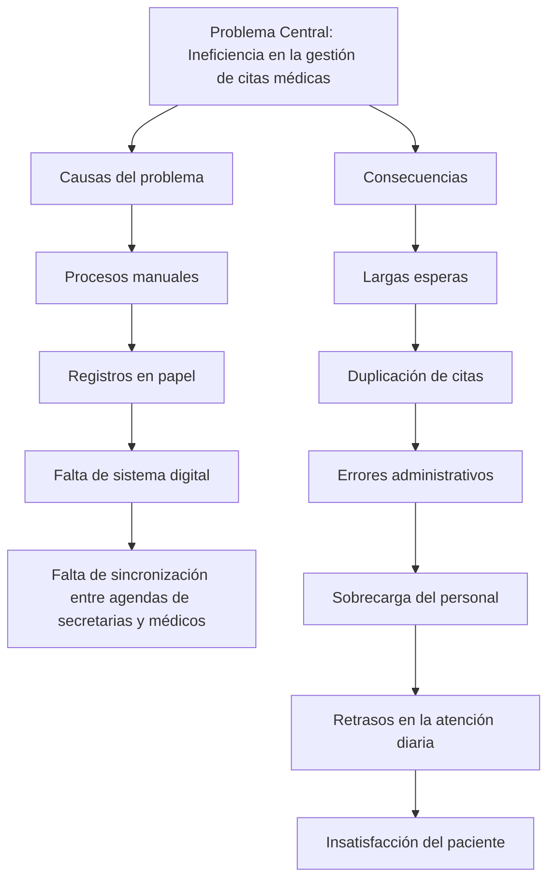

# ÍNDICE TENTATIVO 
## Sistema Web de Gestión de Citas Médicas para el Hospital Traumatológico y Quirúrgico Prof. Juan Bosch

---

## PÁGINAS PRELIMINARES

Portada
Resumen/Síntesis
Dedicatoria
Agradecimientos
Índice General
Índice de Tablas
Índice de Figuras

---

## **CAPÍTULO 1: ASPECTOS GENERALES**

1.1. Introducción

1.2. Antecedentes

1.3. Planteamiento del Problema

1.4. Justificación

1.5. Motivación

1.6. Importancia del Problema

1.7. Objetivos
- 1.7.1. Objetivo General
- 1.7.2. Objetivos Específicos

1.8. Descripción de la Propuesta

1.9. Alcances y Límites del Proyecto

---

## **CAPÍTULO 2: MARCO TEÓRICO**

2.1. Glosario de Términos

2.2. Conceptos Básicos
- Gestión de citas médicas
- Sistemas web
- Intranet
- Base de datos
- Autenticación por roles

2.3. Sistemas de Gestión de Citas en Hospitales

2.4. Tecnologías a Utilizar
- Python y FastAPI
- PostgreSQL
- HTML, JavaScript y Tailwind CSS
- Docker

2.5. Marco Legal (Ley 172-13)

---

## **CAPÍTULO 3: METODOLOGÍA**

3.1. Tipo de Investigación

3.2. Formulación del Problema

3.3. Métodos de Recolección de Datos
- Observación directa
- Entrevistas
- Encuestas

3.4. Metodología de Desarrollo (Scrum)

3.5. Herramientas y Tecnologías

3.6. Cronograma

3.7. Presupuesto

---

## **CAPÍTULO 4: ANÁLISIS Y DISEÑO DEL SISTEMA**

4.1. Análisis de Requisitos
- Requisitos funcionales
- Requisitos no funcionales

4.2. Casos de Uso

4.3. Diseño de la Base de Datos
- Modelo Entidad-Relación
- Modelo Relacional

4.4. Diseño de la Interfaz de Usuario

4.5. Arquitectura del Sistema

---

## **CAPÍTULO 5: DESARROLLO DEL SISTEMA**

5.1. Configuración del Entorno

5.2. Desarrollo del Backend (FastAPI)

5.3. Desarrollo del Frontend

5.4. Implementación de los Módulos
- Módulo de Registro
- Módulo de Citas
- Módulo de Consulta

---

## **CAPÍTULO 6: SEGURIDAD Y AUTENTICACIÓN**

6.1. Gestión de Usuarios y Roles

6.2. Autenticación y Autorización

6.3. Cifrado y Protección de Datos

6.4. Buenas Prácticas y Políticas de Seguridad

6.5. Cumplimiento de la Ley 172-13

---

## **CAPÍTULO 7: PRUEBAS**

7.1. Plan de Pruebas

7.2. Pruebas Realizadas
- Pruebas unitarias
- Pruebas de integración
- Pruebas con usuarios

7.3. Resultados y Correcciones

---

## **CAPÍTULO 8: IMPLEMENTACIÓN**

8.1. Despliegue del Sistema

8.2. Capacitación del Personal

8.3. Manuales de Usuario

8.4. Plan de Mantenimiento

---

## **CAPÍTULO 9: CONCLUSIONES Y RECOMENDACIONES**

9.1. Conclusiones

9.2. Recomendaciones

9.3. Trabajos Futuros

---

## **REFERENCIAS BIBLIOGRÁFICAS**

---

## **ANEXOS**

**Anexo A:** Instrumentos de Recolección de Datos (encuestas, entrevistas)

**Anexo B:** Diagramas del Sistema

**Anexo C:** Capturas de Pantalla del Sistema

**Anexo D:** Manuales de Usuario

**Anexo E:** Códigos Fuente Principales

---

# Niveles Tablas y Figuras

## PÁGINAS PRELIMINARES

Portada
Resumen/Síntesis
Dedicatoria
Agradecimientos
Índice General
Índice de Tablas - TABLA
Índice de Figuras - TABLA 

---

CAPÍTULO 1: ASPECTOS GENERALES - NIVEL 1

1.1. Introducción - NIVEL 2 
1.2. Antecedentes - NIVEL 2 
1.3. Planteamiento del Problema - NIVEL 2 - FIGURA (proceso actual manual) 
1.4. Justificación - NIVEL 2 
1.5. Motivación - NIVEL 2 
1.6. Importancia del Problema - NIVEL 2 
1.7. Objetivos - NIVEL 2 
1.7.1. Objetivo General - NIVEL 3 
1.7.2. Objetivos Específicos - NIVEL 3 
1.8. Descripción de la Propuesta - NIVEL 2 
1.9. Alcances y Límites del Proyecto - NIVEL 2 - TABLA (alcances y límites resumidos)

---

CAPÍTULO 2: MARCO TEÓRICO - NIVEL 1

2.1. Glosario de Términos - NIVEL 2 - TABLA 
2.2. Conceptos Básicos - NIVEL 2 
● Gestión de citas médicas - NIVEL 3 
● Sistemas web - NIVEL 3 - FIGURA (arquitectura cliente-servidor) 
● Intranet - NIVEL 3 
● Base de datos - NIVEL 3 
● Autenticación por roles - NIVEL 3 
2.3. Sistemas de Gestión de Citas en Hospitales - NIVEL 2 - TABLA (comparación sistemas existentes) 
2.4. Tecnologías a Utilizar - NIVEL 2 - TABLA - FIGURA (logos tecnologías) 
● Python y FastAPI - NIVEL 3 
● PostgreSQL - NIVEL 3 
● HTML, JavaScript y Tailwind CSS - NIVEL 3 
● Docker - NIVEL 3 
2.5. Marco Legal (Ley 172-13) - NIVEL 2 - TABLA (requisitos legales)

---

CAPÍTULO 3: METODOLOGÍA - NIVEL 1

3.1. Tipo de Investigación - NIVEL 2 
3.2. Formulación del Problema - NIVEL 2 
3.3. Métodos de Recolección de Datos - NIVEL 2 
● Observación directa - NIVEL 3 
● Entrevistas - NIVEL 3 
● Encuestas - NIVEL 3 
3.4. Metodología de Desarrollo (Scrum) - NIVEL 2 - FIGURA (proceso Scrum) - TABLA (roles Scrum) 3.5. Herramientas y Tecnologías - NIVEL 2 - TABLA 
3.6. Cronograma - NIVEL 2 - TABLA - FIGURA (Gantt) 
3.7. Presupuesto - NIVEL 2 - TABLA

---

CAPÍTULO 4: ANÁLISIS Y DISEÑO DEL SISTEMA - NIVEL 1

4.1. Análisis de Requisitos - NIVEL 2 - TABLA (requisitos funcionales) - TABLA (requisitos no funcionales) 
● Requisitos funcionales - NIVEL 3 
● Requisitos no funcionales - NIVEL 3 
4.2. Casos de Uso - NIVEL 2 - FIGURA (diagrama casos de uso) - TABLA (descripción casos de uso) 
4.3. Diseño de la Base de Datos - NIVEL 2 - FIGURA (MER) - FIGURA (modelo relacional) - TABLA (diccionario de datos) 
● Modelo Entidad-Relación - NIVEL 3 
● Modelo Relacional - NIVEL 3 
4.4. Diseño de la Interfaz de Usuario - NIVEL 2 - FIGURA (wireframes) - FIGURA (mockups) - FIGURA (prototipos) 
4.5. Arquitectura del Sistema - NIVEL 2 - FIGURA (diagrama componentes) - FIGURA (diagrama despliegue)

---

CAPÍTULO 5: DESARROLLO DEL SISTEMA - NIVEL 1

5.1. Configuración del Entorno - NIVEL 2 
5.2. Desarrollo del Backend (FastAPI) - NIVEL 2 - TABLA (endpoints API) - FIGURA (estructura proyecto) 
5.3. Desarrollo del Frontend - NIVEL 2 - FIGURA (estructura frontend) 
5.4. Implementación de los Módulos - NIVEL 2 - TABLA (módulos y funcionalidades) - FIGURA (capturas pantallas) 
● Módulo de Registro - NIVEL 3 
● Módulo de Citas - NIVEL 3 
● Módulo de Consulta - NIVEL 3

---

CAPÍTULO 6: SEGURIDAD Y AUTENTICACIÓN - NIVEL 1

6.1. Gestión de Usuarios y Roles - NIVEL 2 - TABLA (roles y permisos) 
6.2. Autenticación y Autorización - NIVEL 2 - FIGURA (flujo autenticación JWT) - TABLA (matriz autorización) 
6.3. Cifrado y Protección de Datos - NIVEL 2 - TABLA (tipos de datos cifrados) 
6.4. Buenas Prácticas y Políticas de Seguridad - NIVEL 2 - TABLA 
6.5. Cumplimiento de la Ley 172-13 - NIVEL 2

---

CAPÍTULO 7: PRUEBAS - NIVEL 1

7.1. Plan de Pruebas - NIVEL 2 - TABLA 
7.2. Pruebas Realizadas - NIVEL 2 - TABLA (casos de prueba) - FIGURA (ejecución pruebas) ● Pruebas unitarias - NIVEL 3 
● Pruebas de integración - NIVEL 3 
● Pruebas con usuarios - NIVEL 3 
7.3. Resultados y Correcciones - NIVEL 2 - TABLA (resultados) - TABLA (errores y correcciones)

---

CAPÍTULO 8: IMPLEMENTACIÓN - NIVEL 1

8.1. Despliegue del Sistema - NIVEL 2 - FIGURA (arquitectura despliegue Docker) 
8.2. Capacitación del Personal - NIVEL 2 - TABLA (plan capacitación) - FIGURA (fotos sesiones) 
8.3. Manuales de Usuario - NIVEL 2 
8.4. Plan de Mantenimiento - NIVEL 2 - TABLA (cronograma mantenimiento)

---

CAPÍTULO 9: CONCLUSIONES Y RECOMENDACIONES - NIVEL 1

9.1. Conclusiones - NIVEL 2 - TABLA (cumplimiento objetivos) 
9.2. Recomendaciones - NIVEL 2 
9.3. Trabajos Futuros - NIVEL 2

---

REFERENCIAS BIBLIOGRÁFICAS - NIVEL 1

---

ANEXOS - NIVEL 1

Anexo A: Instrumentos de Recolección de Datos - NIVEL 2 
Anexo B: Diagramas del Sistema - NIVEL 2 
Anexo C: Capturas de Pantalla del Sistema - NIVEL 2 
Anexo D: Manuales de Usuario - NIVEL 2 
Anexo E: Códigos Fuente Principales - NIVEL 2

Figura 1 Planteamiento del Problema
