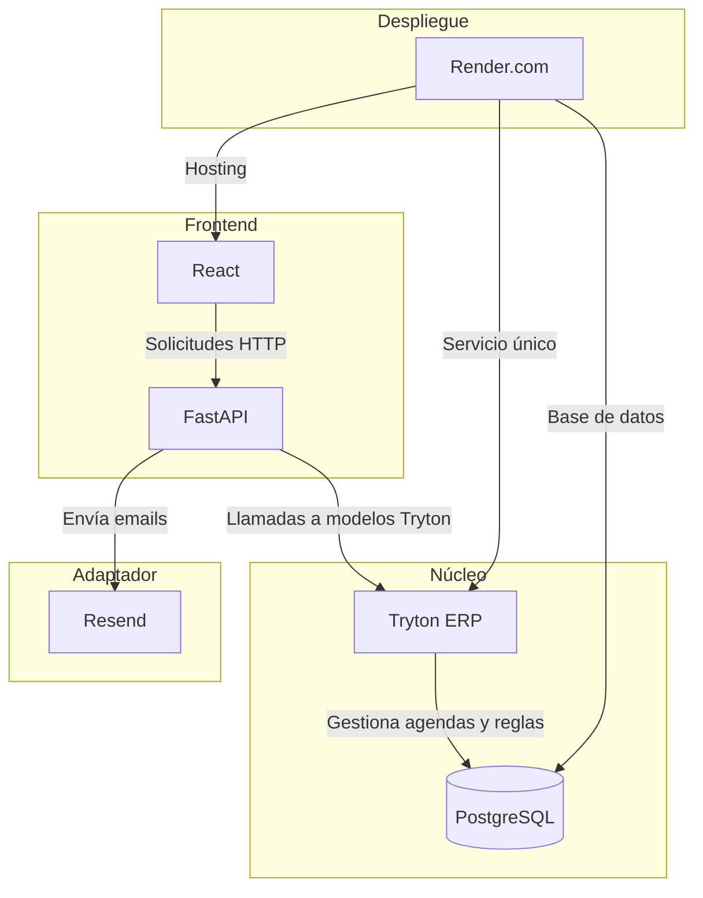
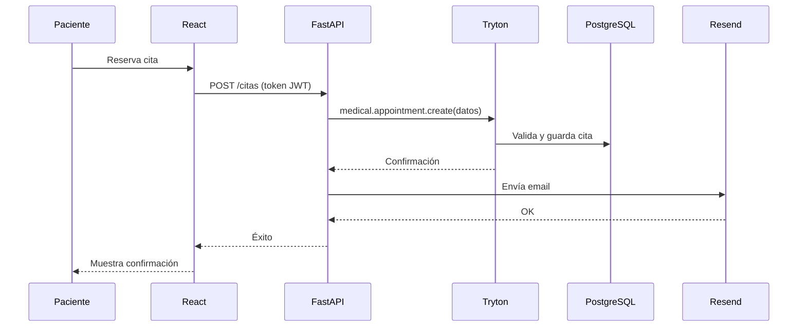
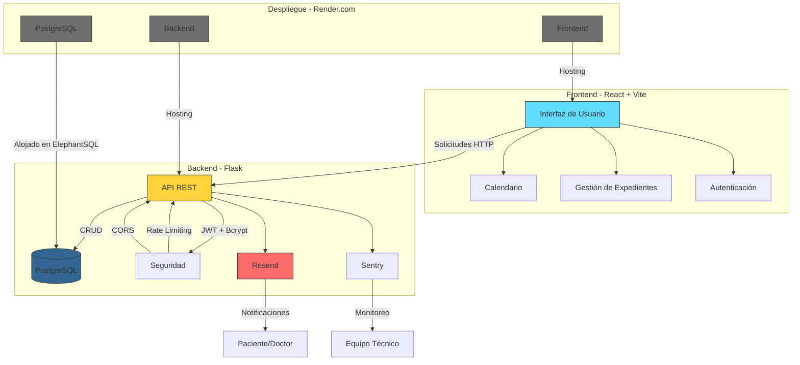
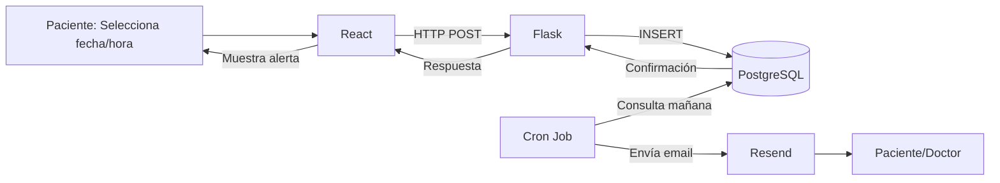

# **Idea 1 con Tryton ERP**

### **Título del proyecto**:  
"Desarrollo de un Sistema de Gestión de Citas para Clínicas Pequeñas y Consultorios Médicos"

---

### **Problemática**:  
En clínicas pequeñas y consultorios médicos, la gestión manual de citas genera problemas como:  
- Largas esperas y conflictos en asignación de turnos.  
- Duplicación de récords médicos y errores en la programación.  
- Interrupciones a profesionales y atención a pacientes sin cita previa.  
- Falta de sincronización con calendarios digitales y notificaciones ineficientes.  

---

### **Objetivo General**:  
Desarrollar un sistema de gestión de citas **centrado en Tryton ERP**, que optimice la organización de agendas médicas, reduzca errores y mejore la experiencia de pacientes y profesionales, con una implementación realista en **4 meses**.

---

### **Objetivos Específicos**:  
1. Implementar un módulo de agendas médicas en **Tryton ERP** para evitar conflictos de horarios.  
2. Integrar validación automática de datos para minimizar errores y duplicación de registros.  
3. Priorizar citas programadas mediante reglas de negocio en Tryton.  
4. Desarrollar una interfaz en **React** para reserva de citas en línea y visualización con *react-big-calendar*.  
5. Garantizar seguridad mediante roles nativos de Tryton (`web_user`) y JWT para comunicación frontend-backend.  

---

### **Descripción del Proyecto**:  
El sistema se centrará en **Tryton ERP** como núcleo único para gestionar modelos de datos, reglas de negocio y seguridad. Se desarrollará un frontend en **React** conectado a Tryton mediante **FastAPI**, que actuará como adaptador para traducir solicitudes HTTP a llamadas de la API de Tryton.  

Aquí tienes la tabla bien formateada:

|**Componente**|**Tecnología**|**Razón**|
|---|---|---|
|**Núcleo del Sistema**|Tryton ERP (Python)|Gestiona agendas médicas, reglas de negocio y seguridad de forma nativa.|
|**Adaptador de API**|FastAPI|Puente ligero entre React y Tryton (mismo lenguaje: Python).|
|**Frontend**|React + react-big-calendar|Interfaz intuitiva para pacientes y médicos.|
|**Base de Datos**|PostgreSQL|Almacenamiento confiable de datos médicos.|
|**Notificaciones**|Resend (Email)|Envío básico de recordatorios por correo electrónico.|
|**Despliegue**|Render.com (Servicio único)|Hosting simplificado con Tryton, FastAPI y React en un solo entorno.|

**Duración del Proyecto**: 4 meses (etapas ajustadas):  
6. **Mes 1**: Configuración de Tryton + modelos básicos (citas, pacientes, médicos).  
7. **Mes 2**: Desarrollo de la API en FastAPI y conexión con Tryton.  
8. **Mes 3**: Frontend en React con calendario y formularios de reserva.  
9. **Mes 4**: Integración de notificaciones por email y despliegue en Render.com.  

**Alcance Geográfico**: Clínicas y consultorios en La Vega (implementación piloto).  

---

### **Alcance del Sistema**:  
**Funcionalidades Principales (MVP)**:  
10. **Agendas Médicas Dinámicas**:  
   - Asignación de citas sin conflictos de horarios (reglas en Tryton).  
11. **Reserva en Línea**:  
   - Formulario simplificado para pacientes en React.  
12. **Notificaciones Automáticas**:  
   - Recordatorios por email (Resend) 24h antes de la cita.  
13. **Historial de Citas**:  
   - Visualización básica para médicos y pacientes.  
14. **Seguridad**:  
   - Roles de usuario (médico/paciente) gestionados por Tryton.  

**Funcionalidades Postergadas** (para futuras iteraciones):  
- Integración con Google Calendar/Outlook.  
- Notificaciones por SMS/WhatsApp (Twilio).  
- Sincronización con sistemas EMR externos.  

---

### **Diagrama de Arquitectura Simplificada**:  

---

### **Ejemplo de Flujo Simplificado**:  

---

# **Idea 2 sin Tryton ERP**

Tecnología Utilizada: El sistema se construirá utilizando **Flask (Python)** como backend para garantizar modularidad y adaptabilidad. La base de datos **PostgreSQL**, alojada en **ElephantSQL**, será la encargada de almacenar y gestionar datos críticos como citas médicas, historiales de pacientes y registros clínicos. Para la interfaz de usuario, se empleará **React + Vite**, asegurando rapidez y eficiencia en la experiencia del usuario. Además, se integrará **react-big-calendar** para la gestión visual de citas. La autenticación se implementará con **JWT + Bcrypt**, proporcionando seguridad en el manejo de credenciales y sesiones. Para las notificaciones, se utilizará **Resend** para el envío de correos electrónicos. El monitoreo de errores en producción podrá ser gestionado con **Sentry** (opcional). Finalmente, todo el sistema será desplegado en **Render.com**, una plataforma que permite gestionar React, Flask y PostgreSQL sin configuraciones complejas, garantizando escalabilidad y facilidad de mantenimiento.

### **Stack Tecnológico Actualizado** 🛠️  

| **Componente**     | **Tecnología**        | **Razón**                                                                      |
| ------------------ | --------------------- | ------------------------------------------------------------------------------ |
| **Frontend**       | React + Vite          | Ligero y rápido. Usa `react-big-calendar` para gestión visual de citas.        |
| **Backend**        | Flask (Python)        | Flexible y fácil de aprender. Ideal para APIs REST.                            |
| **Base de Datos**  | **PostgreSQL**        | Escalable desde el inicio. Usa **ElephantSQL** (PostgreSQL gratis en la nube). |
| **Autenticación**  | **JWT + Bcrypt**      | Contraseñas encriptadas y tokens seguros con expiración.                       |
| **Notificaciones** | Resend (Email)        | API fácil y gratuita para emails.                                              |
| **Logs/Errores**   | **Sentry (opcional)** | Monitoreo proactivo de errores en producción.                                  |
| **Despliegue**     | Render.com            | Soporta PostgreSQL, Flask y React sin configuración compleja.                  |

Flujo de trabajo:

### **Leyenda de Componentes** 🧱  

| **Elemento**              | **Descripción**                                                                 |
| ------------------------- | ------------------------------------------------------------------------------- |
| **Rectángulos**           | Módulos principales del sistema.                                                |
| **Flechas**               | Dirección del flujo de datos y comunicación entre componentes.                  |
| **Colores:**              |                                                                                 |
| - `#61dafb` (Azul)        | **Frontend**: React + Vite (interfaz de usuario).                               |
| - `#FFD43B` (Amarillo)    | **Backend**: Flask (API REST y lógica de negocio).                              |
| - `#336791` (Azul oscuro) | **Base de Datos**: PostgreSQL en ElephantSQL.                                   |
| - `#FF6B6B` (Rojo)        | **Servicios Externos**: Resend (notificaciones) y Sentry (errores).             |
| - `#6e6e6e` (Gris)        | **Infraestructura**: Render.com (hosting de frontend, backend y base de datos). |

---

### **Flujos Clave** 🔄  

1. **Autenticación JWT + Bcrypt**  
   - Usuario inicia sesión en React → Flask valida credenciales → PostgreSQL almacena contraseña cifrada.  

2. **Gestión de Citas Médicas**  
   - Creación de citas en `react-big-calendar` → Flask procesa la solicitud → PostgreSQL guarda la cita → Cron Job activa Resend para recordatorios.  

3. **Operaciones CRUD en Tiempo Real**  
   - Médicos actualizan expedientes desde React → Flask valida permisos (RBAC) → PostgreSQL actualiza registros.  

4. **Notificaciones Automatizadas**  
   - Cron Job verifica PostgreSQL diariamente → Resend envía emails con detalles de citas próximas.  

5. **Seguridad Integral**  
   - **JWT**: Tokens de sesión con expiración.  
   - **Rate Limiting**: Límite de solicitudes por IP.  
   - **CORS**: Restringe acceso solo al dominio del frontend.  

6. **Despliegue Serverless**  
   - Render.com aloja:  
     - **Frontend**: React como sitio estático.  
     - **Backend**: Flask como servicio web.  
     - **PostgreSQL**: Instancia gestionada por ElephantSQL.  

---

### **Ejemplo de Flujo: Creación de una Cita** 🗓️  

