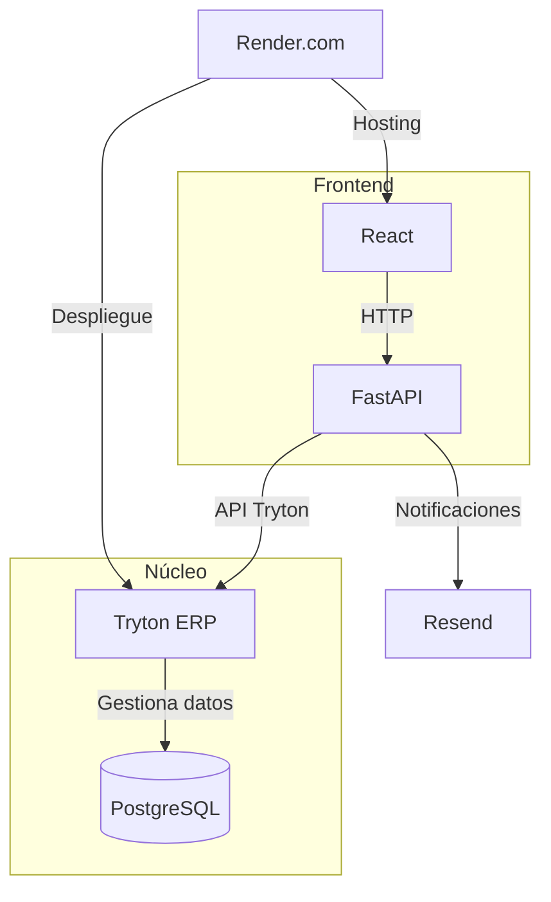

**Desarrollo de un Sistema de Gestión de Citas para Clínicas Pequeñas y Consultorios Médicos**  

---

### **Resumen**  
Este proyecto desarrolla un sistema de gestión de citas médicas basado en **Tryton ERP**, dirigido a clínicas pequeñas y consultorios. El sistema optimiza agendas médicas mediante validación automática de horarios, reduce errores manuales y mejora la experiencia de usuarios con una interfaz en React. Se integra FastAPI como adaptador de API y Resend para notificaciones por email. El MVP se implementará en **4 meses**, priorizando seguridad con roles de Tryton y JWT.  

**Palabras clave**: Tryton ERP, gestión de citas médicas, React, FastAPI, seguridad clínica.  

---

### **Problemática**  
La gestión manual de citas en clínicas y consultorios genera:  
- Conflictos en asignación de turnos y duplicación de registros.  
- Interrupciones a profesionales por pacientes sin cita.  
- Falta de sincronización con herramientas digitales.  

---

### **Objetivos**  

#### **Objetivo General**  
Desarrollar un sistema de gestión de citas centrado en Tryton ERP para optimizar agendas médicas, reducir errores y mejorar la experiencia de usuarios en **4 meses**.  

#### **Objetivos Específicos**  
1. Implementar módulos de agendas médicas en Tryton ERP.  
2. Integrar validación automática para evitar duplicidad de datos.  
3. Priorizar citas mediante reglas de negocio en Tryton.  
4. Desarrollar interfaz en React con react-big-calendar.  
5. Garantizar seguridad con roles de Tryton (`web_user`) y JWT.  

---

### **Descripción del Proyecto**  
El sistema utiliza **Tryton ERP** como núcleo para gestionar modelos de datos y seguridad. Un frontend en **React** se conecta mediante **FastAPI**, que traduce solicitudes HTTP a la API de Tryton. Incluye:  
- Agendas médicas dinámicas con prevención de conflictos.  
- Reserva de citas en línea para pacientes.  
- Notificaciones automáticas vía Resend.  

---

### **Tecnologías Utilizadas**  

| **Componente**       | **Tecnología**    | **Función**                                |  
|-----------------------|-------------------|--------------------------------------------|  
| Núcleo del sistema    | Tryton ERP        | Gestión de reglas de negocio y seguridad.  |  
| Adaptador de API      | FastAPI           | Conexión entre frontend y Tryton.          |  
| Frontend              | React             | Interfaz de usuario interactiva.           |  
| Base de datos         | PostgreSQL        | Almacenamiento seguro de datos médicos.    |  

---

### **Cronograma**  
| **Mes** | **Actividad**                                      |  
|---------|----------------------------------------------------|  
| 1       | Configuración de Tryton y modelos básicos.         |  
| 2       | Desarrollo de API en FastAPI.                      |  
| 3       | Implementación de frontend en React.               |  
| 4       | Integración de notificaciones y despliegue final.  |  

---

### **Alcance**  

#### **Geográfico**  
Implementación piloto en **clínicas y consultorios de La Vega (República Dominicana)**.  

#### **Funcionalidades (MVP)**  
- Registro y gestión de citas sin conflictos.  
- Reserva en línea con React.  
- Recordatorios por email (Resend).  
- Roles de usuario (médico/paciente).  

#### **Funcionalidades Postergadas**  
- Integración con Google Calendar/Outlook.  
- Notificaciones por SMS/WhatsApp.  

---

### **Diagrama de Arquitectura**  

---
