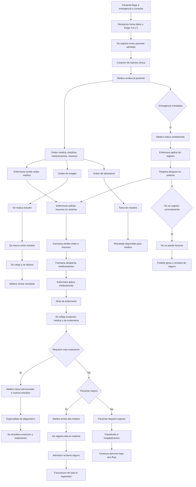
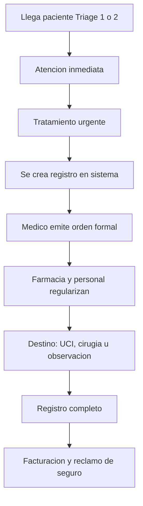

ambulatorio
1recepcion
2consulta o imagen o laboratorio
2autorizacion
tengo seguro pase aqui
no tiene seguro? pase aqui
pase a caja
3crea servicio de sallud solicita test de imagen
servicio de salud abro el seguro me coubre algo y pago lo otro voy a laboratorio
imagenes lo mismo 

---

creamos los servicios de laboratorio y imagen
servicio de salud