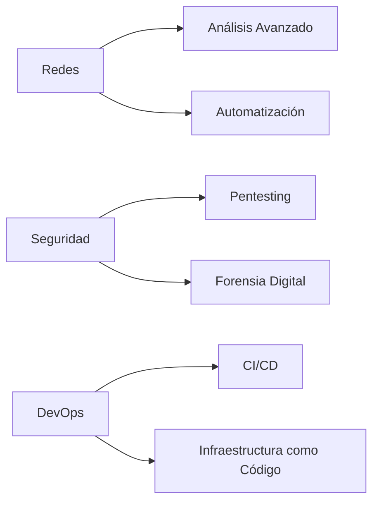

# 🐧💻 Linux & Cybersecurity Knowledge Hub 

Repositorio especializado en administración de sistemas Linux, scripting avanzado y técnicas de ciberseguridad.

## 📌 Sobre este Proyecto

Este repositorio es un centro de conocimiento integral que documenta mi aprendizaje y proyectos en:

- **Administración de Sistemas**: Enfocado en Linux y Windows, con guías sobre scripting, automatización y gestión de servidores.
- **Ciberseguridad**: Técnicas de hacking ético, pentesting, análisis de red y herramientas de seguridad.
- **Desarrollo**: Proyectos prácticos como bases de datos y un sistema de gestión de citas médicas.
- **Laboratorios Prácticos**: Ejercicios en Bash, Python y herramientas de red para reforzar habilidades técnicas.
- **Recursos Adicionales**: Guías rápidas sobre Android, Blender, Git, Python y un glosario de programación.

  

## 🚀 Contenido Destacado

### 🛠️ Fundamentos Linux
```bash
📂 Gestión avanzada de permisos
🔍 Comandos de análisis de red (tcpdump, nmap)
⚡ Automatización con cron y systemd
📦 Package management (apt, dpkg)
```

### 🧠 Bash Scripting Avanzado
```bash
🔄 Scripts de automatización de redes
🔒 Herramientas de seguridad personalizadas
📊 Procesamiento avanzado de datos (awk, sed)
🎨 Scripts con interfaz colorida
```

### 🔐 Ciberseguridad Práctica
```bash
🔎 Metodologías de pentesting
📡 Análisis de tráfico de red
🛡️ Hardening de servidores
🌐 Técnicas OSINT avanzadas
```

## 🧪 Laboratorios & Scripts  

| Herramienta                                                                                                                                                                                                                                                                                                                                                                                                                                                                                                                                                                                                                                                                                    | Descripción                                  | Última Actualización |
| ---------------------------------------------------------------------------------------------------------------------------------------------------------------------------------------------------------------------------------------------------------------------------------------------------------------------------------------------------------------------------------------------------------------------------------------------------------------------------------------------------------------------------------------------------------------------------------------------------------------------------------------------------------------------------------------------- | -------------------------------------------- | -------------------- |
| [Detector de SO](obsidian://open?vault=linuxknowledge&file=01-Sistemas-Operativos%2FLinux%2F1-%20El%20Hacker%20Legendario%20%F0%9F%90%A7%F0%9F%90%8D%20-%20Fundamentos%2C%20Hacking%20y%20Certificaciones%2F1-%20Curso%20de%20Linux%20y%20Bash%20Scripting%2F9-%20Ejercicios%20Pr%C3%A1cticos%2F9-%20Detector%20de%20Sistemas%20Operativos%20%E2%80%93%20PARTE%201): [🔍 Detector de SO](https://github.com/je7remy/linuxknowledge/blob/main/01-Sistemas-Operativos/Linux/1-%20El%20Hacker%20Legendario%20%F0%9F%90%A7%F0%9F%90%8D%20-%20Fundamentos%2C%20Hacking%20y%20Certificaciones/1-%20Curso%20de%20Linux%20y%20Bash%20Scripting/9-%20Ejercicios%20Pr%C3%A1cticos/9-%20Detector%20de%20Sistemas%20Operativos%20%E2%80%93%20PARTE%201.md)                                                                                     | Identifica sistemas operativos en red        | Ene 2025             |
| [Fuzzing Web](obsidian://open?vault=linuxknowledge&file=01-Sistemas-Operativos%2FLinux%2F1-%20El%20Hacker%20Legendario%20%F0%9F%90%A7%F0%9F%90%8D%20-%20Fundamentos%2C%20Hacking%20y%20Certificaciones%2F1-%20Curso%20de%20Linux%20y%20Bash%20Scripting%2F9-%20Ejercicios%20Pr%C3%A1cticos%2F2-%20Bash%20Scripting%20Aplicado%20a%20Ciberseguridad%20%E2%80%93%20Script%20para%20Hacer%20Fuzzing%20Web): [🕸️ Fuzzing Web](https://github.com/je7remy/linuxknowledge/blob/main/01-Sistemas-Operativos/Linux/1-%20El%20Hacker%20Legendario%20%F0%9F%90%A7%F0%9F%90%8D%20-%20Fundamentos%2C%20Hacking%20y%20Certificaciones/1-%20Curso%20de%20Linux%20y%20Bash%20Scripting/9-%20Ejercicios%20Pr%C3%A1cticos/2-%20Bash%20Scripting%20Aplicado%20a%20Ciberseguridad%20%E2%80%93%20Script%20para%20Hacer%20Fuzzing%20Web.md)              | Script para descubrir directorios ocultos    | Ene 2025             |
| [Auto Backup SSH](obsidian://open?vault=linuxknowledge&file=01-Sistemas-Operativos%2FLinux%2F1-%20El%20Hacker%20Legendario%20%F0%9F%90%A7%F0%9F%90%8D%20-%20Fundamentos%2C%20Hacking%20y%20Certificaciones%2F1-%20Curso%20de%20Linux%20y%20Bash%20Scripting%2F8-%20Gesti%C3%B3n%20de%20Servidores%20con%20Scripts%20de%20Bash%2F7-%20Automatizaci%C3%B3n%20de%20Copias%20de%20Seguridad%20en%20Servidor%20SSH): [💾 Auto Backup SSH](https://github.com/je7remy/linuxknowledge/blob/main/01-Sistemas-Operativos/Linux/1-%20El%20Hacker%20Legendario%20%F0%9F%90%A7%F0%9F%90%8D%20-%20Fundamentos%2C%20Hacking%20y%20Certificaciones/1-%20Curso%20de%20Linux%20y%20Bash%20Scripting/8-%20Gesti%C3%B3n%20de%20Servidores%20con%20Scripts%20de%20Bash/7-%20Automatizaci%C3%B3n%20de%20Copias%20de%20Seguridad%20en%20Servidor%20SSH.md) | Sistema automatizado de copias seguras       | Ene 2025             |
| [Analizador de Red](obsidian://open?vault=linuxknowledge&file=01-Sistemas-Operativos%2FLinux%2F1-%20El%20Hacker%20Legendario%20%F0%9F%90%A7%F0%9F%90%8D%20-%20Fundamentos%2C%20Hacking%20y%20Certificaciones%2F1-%20Curso%20de%20Linux%20y%20Bash%20Scripting%2F9-%20Ejercicios%20Pr%C3%A1cticos%2F5-%20An%C3%A1lisis%20de%20la%20Red%20con%20Bash%20%E2%80%93%20PARTE%203): [📡 Analizador de Red](https://github.com/je7remy/linuxknowledge/blob/main/01-Sistemas-Operativos/Linux/1-%20El%20Hacker%20Legendario%20%F0%9F%90%A7%F0%9F%90%8D%20-%20Fundamentos%2C%20Hacking%20y%20Certificaciones/1-%20Curso%20de%20Linux%20y%20Bash%20Scripting/9-%20Ejercicios%20Pr%C3%A1cticos/5-%20An%C3%A1lisis%20de%20la%20Red%20con%20Bash%20%E2%80%93%20PARTE%203.md)                                                                       | Kit de herramientas para análisis de tráfico | Dic 2024             |

| Sección          | Herramienta/Script                                                                                                           | Descripción                            | Ubicación                                                                                                                                                                                                                   |
| ---------------- | ---------------------------------------------------------------------------------------------------------------------------- | -------------------------------------- | --------------------------------------------------------------------------------------------------------------------------------------------------------------------------------------------------------------------------- |
| **Laboratorios** | [Laboratorios de Bash](https://github.com/je7remy/linuxknowledge/blob/main/04-Laboratorios/1-%20Laboratorios%20de%20Bash.md) | Ejercicios prácticos en Bash scripting | [Obsidian](obsidian://open?vault=linuxknowledge&file=04-Laboratorios%2F1-%20Laboratorios%20de%20Bash) - [GitHub](https://github.com/je7remy/linuxknowledge/blob/main/04-Laboratorios/1-%20Laboratorios%20de%20Bash.md) |
| **Recursos**     | [Guía de Git](https://github.com/je7remy/linuxknowledge/blob/main/05-Recursos/git/1-%20Comandos%20Git.md)                    | Comandos esenciales de Git             | [Obsidian](obsidian://open?vault=linuxknowledge&file=05-Recursos%2Fgit%2F1-%20Comandos%20Git) - [GitHub](https://github.com/je7remy/linuxknowledge/blob/main/05-Recursos/git/1-%20Comandos%20Git.md)                  |

## 📅 Historial de Desarrollo

### 2025
- **Enero**: 🛠️ Suite completa de análisis de red
- **Diciembre 2024**: 🕵️♂️ Implementación de técnicas OSINT
- **Noviembre 2024**: 📜 Políticas de hacking ético

### 2024
- **Octubre**: 🔄 Comparativa metodologías pentesting
- **Septiembre**: 🏗️ Construcción de laboratorio personal
- **Julio**: 🐍 Integración con Python en Linux

## 🌟 Roadmap 2025



## 📚 Recursos Adicionales

Este repositorio incluye recursos valiosos para aprendizaje y referencia:
- **Android**: Guías para instalar Google Play en tablets Amazon y desinstalar apps sin root.
- **Blender**: Comandos básicos para modelado 3D.
- **Canales de YouTube**: Recomendaciones sobre ciberseguridad y hacking ético.
- **Fundamentos de Python**: Guía rápida para principiantes.
- **Git**: Comandos esenciales y edición de commits.
- **Glosario de Programación**: Los 200 términos más utilizados.


## 🤝 Cómo Contribuir

### Configuración inicial para usuarios de Windows

1. **Agregar el repositorio a las exclusiones de tu antivirus (opcional pero recomendado)**  
    Antes de clonar el repositorio, asegúrate de que tu antivirus (por ejemplo, **Microsoft Defender**) no elimine archivos que puedan considerarse sospechosos pero que en realidad sean **scripts didácticos**.
    
    - Para ello, ve a **Seguridad de Windows** > **Protección contra virus y amenazas** > **Administrar la configuración** > **Agregar o quitar exclusiones**.
    - Agrega una exclusión para la carpeta en la que vayas a clonar este repositorio.
    - De este modo, evitarás que el antivirus bloquee o elimine contenido valioso para el aprendizaje.
2. **Habilitar rutas largas en Git**  
    Si trabajas en Windows, te recomendamos ejecutar el siguiente comando en tu terminal **antes** de clonar el repositorio, para evitar problemas con rutas de archivos largas:
    
    ```bash
    git config --global core.longpaths true
    ```
    
3. **Clona el repositorio**
    
    ```bash
    git clone https://github.com/je7remy/linuxknowledge.git
    ```
    
4. **Crea una rama para tu contribución**
    
    ```bash
    git checkout -b feature/nueva-funcionalidad
    ```

5. **Copiar el contenido del repositorio (solo para usuarios de Windows)**  
    Si eres usuario de Windows y deseas copiar el contenido del repositorio a otra ubicación para trabajar en él o hacer una copia de seguridad, usa el siguiente comando en una terminal (como **PowerShell** o el **Símbolo del sistema**) en lugar del explorador de archivos. Esto evita problemas con directorios largos o archivos bloqueados:
    
    ```bash
    robocopy "C:\linuxknowledge" "C:\repos\linuxknowledge" /E /COPYALL /XJ /R:3 /W:5 /MT:16
    ```
    
    - Ajusta las rutas `"C:\linuxknowledge"` (origen) y `"C:\repos\linuxknowledge"` (destino) según la ubicación de tu repositorio y la carpeta donde deseas copiarlo.
    - Este comando asegura una copia completa y confiable del contenido.

6. **Envía tu Pull Request**  
    Envía tu _Pull Request_ con una descripción detallada de los cambios que hiciste.
    


## 📜 Licencia

Este proyecto está bajo licencia [MIT](LICENSE).  
*"El conocimiento es libre, compártelo responsablemente"* - je7remy

---

[](https://github.com/je7remy/linuxknowledge)
[](https://www.linux.org/)

