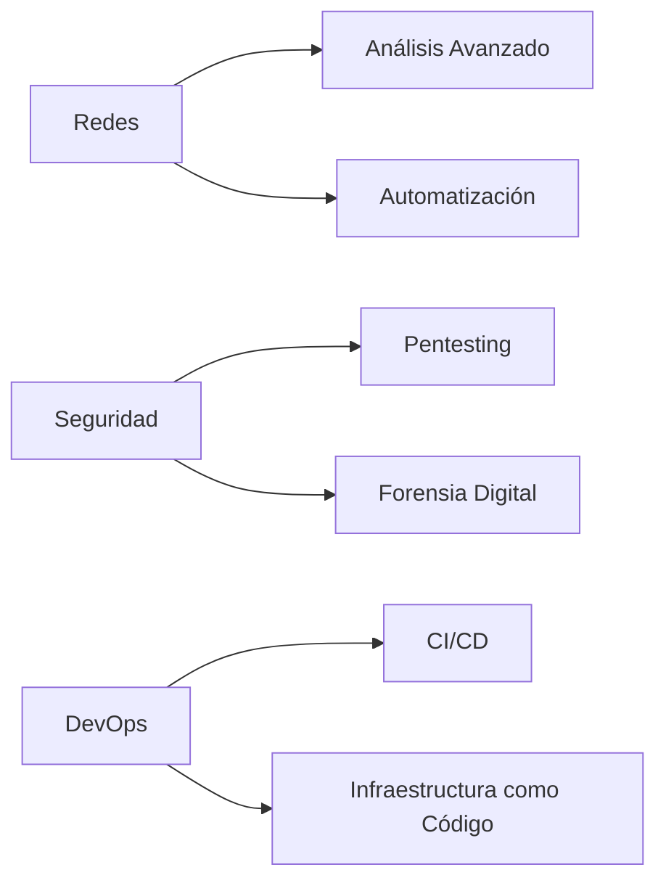

# 🐧💻 Linux & Cybersecurity Knowledge Hub 

Repositorio especializado en administración de sistemas Linux, scripting avanzado y técnicas de ciberseguridad.

## 📌 Sobre este Proyecto

Repositorio activo que documenta mi jornada en:
- Administración profesional de sistemas Linux
- Automatización con Bash scripting
- Técnicas de hacking ético y pentesting
- Desarrollo de herramientas de seguridad
- Laboratorios prácticos de redes y seguridad

  

## 🚀 Contenido Destacado

### 🛠️ Fundamentos Linux
```bash
📂 Gestión avanzada de permisos
🔍 Comandos de análisis de red (tcpdump, nmap)
⚡ Automatización con cron y systemd
📦 Package management (apt, dpkg)
```

### 🧠 Bash Scripting Avanzado
```bash
🔄 Scripts de automatización de redes
🔒 Herramientas de seguridad personalizadas
📊 Procesamiento avanzado de datos (awk, sed)
🎨 Scripts con interfaz colorida
```

### 🔐 Ciberseguridad Práctica
```bash
🔎 Metodologías de pentesting
📡 Análisis de tráfico de red
🛡️ Hardening de servidores
🌐 Técnicas OSINT avanzadas
```

## 🧪 Laboratorios & Scripts

| Herramienta | Descripción | Última Actualización |
|-------------|-------------|----------------------|
| [Detector de SO](lab/detector-so) | Identifica sistemas operativos en red | Ene 2025 |
| [Fuzzing Web](scripts/web-fuzzer) | Script para descubrir directorios ocultos | Ene 2025 |
| [Auto Backup SSH](tools/ssh-backup) | Sistema automatizado de copias seguras | Ene 2025 |
| [Analizador de Red](lab/network-analyzer) | Kit de herramientas para análisis de tráfico | Dic 2024 |

## 📅 Historial de Desarrollo

### 2025
- **Enero**: 🛠️ Suite completa de análisis de red
- **Diciembre 2024**: 🕵️♂️ Implementación de técnicas OSINT
- **Noviembre 2024**: 📜 Políticas de hacking ético

### 2024
- **Octubre**: 🔄 Comparativa metodologías pentesting
- **Septiembre**: 🏗️ Construcción de laboratorio personal
- **Julio**: 🐍 Integración con Python en Linux

## 🌟 Roadmap 2025



## 🤝 Cómo Contribuir

1. Clona el repositorio
```bash
git clone https://github.com/je7remy/linuxknowledge.git
```
2. Crea una rama para tu contribución
```bash
git checkout -b feature/nueva-funcionalidad
```
3. Envía tu Pull Request detallando los cambios

## 📜 Licencia

Este proyecto está bajo licencia [MIT](LICENSE).  
*"El conocimiento es libre, compártelo responsablemente"* - je7remy

---

[](https://github.com/je7remy/linuxknowledge)
[](https://www.linux.org/)
