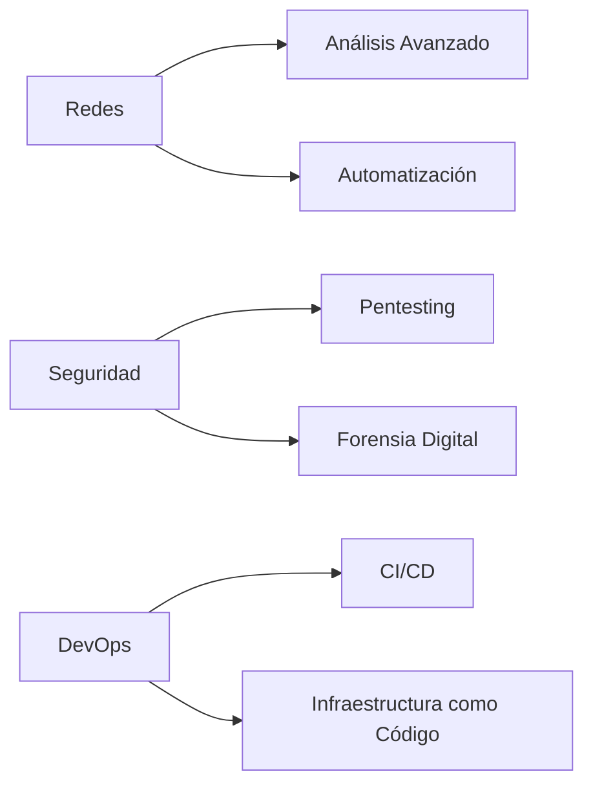

# 🐧💻 Linux & Cybersecurity Knowledge Hub 

Repositorio especializado en administración de sistemas Linux, scripting avanzado y técnicas de ciberseguridad.

## 📌 Sobre este Proyecto

Repositorio activo que documenta mi jornada en:
- Administración profesional de sistemas Linux
- Automatización con Bash scripting
- Técnicas de hacking ético y pentesting
- Desarrollo de herramientas de seguridad
- Laboratorios prácticos de redes y seguridad

  

## 🚀 Contenido Destacado

### 🛠️ Fundamentos Linux
```bash
📂 Gestión avanzada de permisos
🔍 Comandos de análisis de red (tcpdump, nmap)
⚡ Automatización con cron y systemd
📦 Package management (apt, dpkg)
```

### 🧠 Bash Scripting Avanzado
```bash
🔄 Scripts de automatización de redes
🔒 Herramientas de seguridad personalizadas
📊 Procesamiento avanzado de datos (awk, sed)
🎨 Scripts con interfaz colorida
```

### 🔐 Ciberseguridad Práctica
```bash
🔎 Metodologías de pentesting
📡 Análisis de tráfico de red
🛡️ Hardening de servidores
🌐 Técnicas OSINT avanzadas
```

## 🧪 Laboratorios & Scripts

| Herramienta                                                                                                                                                                                                                                                                                                                                                                                                                                                                                                                                                                                                                                                                                                                                                                                                                                                        | Descripción                                  | Última Actualización |
| ------------------------------------------------------------------------------------------------------------------------------------------------------------------------------------------------------------------------------------------------------------------------------------------------------------------------------------------------------------------------------------------------------------------------------------------------------------------------------------------------------------------------------------------------------------------------------------------------------------------------------------------------------------------------------------------------------------------------------------------------------------------------------------------------------------------------------------------------------------------ | -------------------------------------------- | -------------------- |
| [Detector de SO](obsidian://open?vault=linuxknowledge&file=El%20Compendio%20del%20Hacker%20Legendario%20%F0%9F%93%96%F0%9F%8F%86%2F1-%20Linux%20y%20Bash%20Scripting%2F9-%20Ejercicios%20Pr%C3%A1cticos%2F10-%20Detector%20de%20Sistemas%20Operativos%20%E2%80%93%20PARTE%202)[linuxknowledge/El Compendio del Hacker Legendario 📖🏆/1- Linux y Bash Scripting/9- Ejercicios Prácticos/10- Detector de Sistemas Operativos – PARTE 2.md at main · je7remy/linuxknowledge](https://github.com/je7remy/linuxknowledge/blob/main/El%20Compendio%20del%20Hacker%20Legendario%20%F0%9F%93%96%F0%9F%8F%86/1-%20Linux%20y%20Bash%20Scripting/9-%20Ejercicios%20Pr%C3%A1cticos/10-%20Detector%20de%20Sistemas%20Operativos%20%E2%80%93%20PARTE%202.md)                                                                                                                    | Identifica sistemas operativos en red        | Ene 2025             |
| [Fuzzing Web](obsidian://open?vault=linuxknowledge&file=El%20Compendio%20del%20Hacker%20Legendario%20%F0%9F%93%96%F0%9F%8F%86%2F1-%20Linux%20y%20Bash%20Scripting%2F9-%20Ejercicios%20Pr%C3%A1cticos%2F2-%20Bash%20Scripting%20Aplicado%20a%20Ciberseguridad%20%E2%80%93%20Script%20para%20Hacer%20Fuzzing%20Web)[linuxknowledge/El Compendio del Hacker Legendario 📖🏆/1- Linux y Bash Scripting/9- Ejercicios Prácticos/2- Bash Scripting Aplicado a Ciberseguridad – Script para Hacer Fuzzing Web.md at main · je7remy/linuxknowledge](https://github.com/je7remy/linuxknowledge/blob/main/El%20Compendio%20del%20Hacker%20Legendario%20%F0%9F%93%96%F0%9F%8F%86/1-%20Linux%20y%20Bash%20Scripting/9-%20Ejercicios%20Pr%C3%A1cticos/2-%20Bash%20Scripting%20Aplicado%20a%20Ciberseguridad%20%E2%80%93%20Script%20para%20Hacer%20Fuzzing%20Web.md)             | Script para descubrir directorios ocultos    | Ene 2025             |
| [Auto Backup SSH](obsidian://open?vault=linuxknowledge&file=El%20Compendio%20del%20Hacker%20Legendario%20%F0%9F%93%96%F0%9F%8F%86%2F1-%20Linux%20y%20Bash%20Scripting%2F8-%20Gesti%C3%B3n%20de%20Servidores%20con%20Scripts%20de%20Bash%2F7-%20Automatizaci%C3%B3n%20de%20Copias%20de%20Seguridad%20en%20Servidor%20SSH)[linuxknowledge/El Compendio del Hacker Legendario 📖🏆/1- Linux y Bash Scripting/8- Gestión de Servidores con Scripts de Bash/7- Automatización de Copias de Seguridad en Servidor SSH.md at main · je7remy/linuxknowledge](https://github.com/je7remy/linuxknowledge/blob/main/El%20Compendio%20del%20Hacker%20Legendario%20%F0%9F%93%96%F0%9F%8F%86/1-%20Linux%20y%20Bash%20Scripting/8-%20Gesti%C3%B3n%20de%20Servidores%20con%20Scripts%20de%20Bash/7-%20Automatizaci%C3%B3n%20de%20Copias%20de%20Seguridad%20en%20Servidor%20SSH.md) | Sistema automatizado de copias seguras       | Ene 2025             |
| [Analizador de Red](obsidian://open?vault=linuxknowledge&file=El%20Compendio%20del%20Hacker%20Legendario%20%F0%9F%93%96%F0%9F%8F%86%2F1-%20Linux%20y%20Bash%20Scripting%2F9-%20Ejercicios%20Pr%C3%A1cticos%2F5-%20An%C3%A1lisis%20de%20la%20Red%20con%20Bash%20%E2%80%93%20PARTE%203)[linuxknowledge/El Compendio del Hacker Legendario 📖🏆/1- Linux y Bash Scripting/9- Ejercicios Prácticos/5- Análisis de la Red con Bash – PARTE 3.md at main · je7remy/linuxknowledge](https://github.com/je7remy/linuxknowledge/blob/main/El%20Compendio%20del%20Hacker%20Legendario%20%F0%9F%93%96%F0%9F%8F%86/1-%20Linux%20y%20Bash%20Scripting/9-%20Ejercicios%20Pr%C3%A1cticos/5-%20An%C3%A1lisis%20de%20la%20Red%20con%20Bash%20%E2%80%93%20PARTE%203.md)                                                                                                              | Kit de herramientas para análisis de tráfico | Dic 2024             |

## 📅 Historial de Desarrollo

### 2025
- **Enero**: 🛠️ Suite completa de análisis de red
- **Diciembre 2024**: 🕵️♂️ Implementación de técnicas OSINT
- **Noviembre 2024**: 📜 Políticas de hacking ético

### 2024
- **Octubre**: 🔄 Comparativa metodologías pentesting
- **Septiembre**: 🏗️ Construcción de laboratorio personal
- **Julio**: 🐍 Integración con Python en Linux

## 🌟 Roadmap 2025



## 🤝 Cómo Contribuir

1. Clona el repositorio
```bash
git clone https://github.com/je7remy/linuxknowledge.git
```
2. Crea una rama para tu contribución
```bash
git checkout -b feature/nueva-funcionalidad
```
3. Envía tu Pull Request detallando los cambios

## 📜 Licencia

Este proyecto está bajo licencia [MIT](LICENSE).  
*"El conocimiento es libre, compártelo responsablemente"* - je7remy

---

[](https://github.com/je7remy/linuxknowledge)
[](https://www.linux.org/)