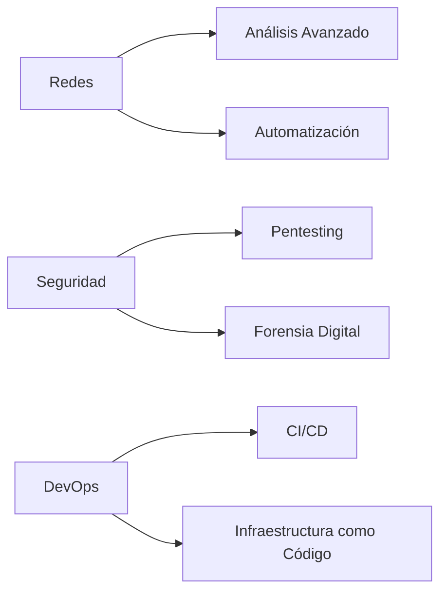

---

# 🐧💻 Linux & Cybersecurity Knowledge Hub 

Repositorio especializado en administración de sistemas Linux, scripting avanzado y técnicas de ciberseguridad.


  
## 📌 Sobre este Proyecto

Este repositorio es un centro de conocimiento integral que documenta mi aprendizaje y proyectos en:

- **Administración de Sistemas**: Guías detalladas sobre Linux y Windows, incluyendo scripting, automatización y gestión de servidores.
- **Ciberseguridad**: Técnicas de hacking ético, pentesting, análisis de red y herramientas de seguridad como Nmap y Hashcat.
- **Desarrollo**: Proyectos prácticos como bases de datos y una tesis sobre un sistema de gestión de citas médicas.
- **Laboratorios Prácticos**: Ejercicios en Bash, Python y herramientas de red para reforzar habilidades técnicas.
- **Recursos Adicionales**: Guías rápidas sobre Android, Blender, Git, Python, JavaScript y un glosario de programación.

  

## 🚀 Contenido Destacado

### 🛠️ Fundamentos Linux
- [Configuración Básica de Máquina Virtual Kali Linux](https://github.com/je7remy/linuxknowledge/blob/main/01-Sistemas-Operativos/Linux/0-%20Configuracion%20inicial/Configuración%20Básica%20de%20Máquina%20Virtual%20Kali%20Linux.md)
- [Comandos Básicos - Intermedio]([linuxknowledge/01-Sistemas-Operativos/Linux/1- El Hacker Legendario 🐧🐍 - Fundamentos, Hacking y Certificaciones/3- Preparación para la Certificación del eJPTv2/1- Curso de Linux y Bash Scripting/1- Uso Básico de Linux/1- Comandos Basicos - Intermedio.md at main · je7remy/linuxknowledge](https://github.com/je7remy/linuxknowledge/blob/main/01-Sistemas-Operativos/Linux/1-%20El%20Hacker%20Legendario%20%F0%9F%90%A7%F0%9F%90%8D%20-%20Fundamentos%2C%20Hacking%20y%20Certificaciones/3-%20Preparaci%C3%B3n%20para%20la%20Certificaci%C3%B3n%20del%20eJPTv2/1-%20Curso%20de%20Linux%20y%20Bash%20Scripting/1-%20Uso%20B%C3%A1sico%20de%20Linux/1-%20Comandos%20Basicos%20-%20Intermedio.md))
- [Gestión de Usuarios en Linux]([linuxknowledge/01-Sistemas-Operativos/Linux/1- El Hacker Legendario 🐧🐍 - Fundamentos, Hacking y Certificaciones/3- Preparación para la Certificación del eJPTv2/1- Curso de Linux y Bash Scripting/1- Uso Básico de Linux/6- Gestión de Usuarios en Linux.md at main · je7remy/linuxknowledge](https://github.com/je7remy/linuxknowledge/blob/main/01-Sistemas-Operativos/Linux/1-%20El%20Hacker%20Legendario%20%F0%9F%90%A7%F0%9F%90%8D%20-%20Fundamentos%2C%20Hacking%20y%20Certificaciones/3-%20Preparaci%C3%B3n%20para%20la%20Certificaci%C3%B3n%20del%20eJPTv2/1-%20Curso%20de%20Linux%20y%20Bash%20Scripting/1-%20Uso%20B%C3%A1sico%20de%20Linux/6-%20Gesti%C3%B3n%20de%20Usuarios%20en%20Linux.md))

### 🧠 Bash Scripting Avanzado
- [Bucle FOR – Parte 1]([linuxknowledge/01-Sistemas-Operativos/Linux/1- El Hacker Legendario 🐧🐍 - Fundamentos, Hacking y Certificaciones/3- Preparación para la Certificación del eJPTv2/1- Curso de Linux y Bash Scripting/5- Bucles/1- Bucle FOR – Parte 1.md at main · je7remy/linuxknowledge](https://github.com/je7remy/linuxknowledge/blob/main/01-Sistemas-Operativos/Linux/1-%20El%20Hacker%20Legendario%20%F0%9F%90%A7%F0%9F%90%8D%20-%20Fundamentos%2C%20Hacking%20y%20Certificaciones/3-%20Preparaci%C3%B3n%20para%20la%20Certificaci%C3%B3n%20del%20eJPTv2/1-%20Curso%20de%20Linux%20y%20Bash%20Scripting/5-%20Bucles/1-%20Bucle%20FOR%20%E2%80%93%20Parte%201.md))
- [Sentencias Condicionales – IF, ELIF y ELSE]([linuxknowledge/01-Sistemas-Operativos/Linux/1- El Hacker Legendario 🐧🐍 - Fundamentos, Hacking y Certificaciones/3- Preparación para la Certificación del eJPTv2/1- Curso de Linux y Bash Scripting/4- Sentencias Condicionales/1- Sentencias Condicionales – IF, ELIF y ELSE.md at main · je7remy/linuxknowledge](https://github.com/je7remy/linuxknowledge/blob/main/01-Sistemas-Operativos/Linux/1-%20El%20Hacker%20Legendario%20%F0%9F%90%A7%F0%9F%90%8D%20-%20Fundamentos%2C%20Hacking%20y%20Certificaciones/3-%20Preparaci%C3%B3n%20para%20la%20Certificaci%C3%B3n%20del%20eJPTv2/1-%20Curso%20de%20Linux%20y%20Bash%20Scripting/4-%20Sentencias%20Condicionales/1-%20Sentencias%20Condicionales%20%E2%80%93%20IF%2C%20ELIF%20y%20ELSE.md))
- [Declarar Funciones en Bash]([linuxknowledge/01-Sistemas-Operativos/Linux/1- El Hacker Legendario 🐧🐍 - Fundamentos, Hacking y Certificaciones/3- Preparación para la Certificación del eJPTv2/1- Curso de Linux y Bash Scripting/6- Funciones/1- Declarar Funciones en Bash.md at main · je7remy/linuxknowledge](https://github.com/je7remy/linuxknowledge/blob/main/01-Sistemas-Operativos/Linux/1-%20El%20Hacker%20Legendario%20%F0%9F%90%A7%F0%9F%90%8D%20-%20Fundamentos%2C%20Hacking%20y%20Certificaciones/3-%20Preparaci%C3%B3n%20para%20la%20Certificaci%C3%B3n%20del%20eJPTv2/1-%20Curso%20de%20Linux%20y%20Bash%20Scripting/6-%20Funciones/1-%20Declarar%20Funciones%20en%20Bash.md))

### 🔐 Ciberseguridad Práctica
- [Hoja de Trucos NMAP](https://github.com/je7remy/linuxknowledge/blob/main/02-Ciberseguridad/5-%20reconocimiento/1-%20Nmap/1-%20Hoja%20de%20trucos%20NMAP.md)
- [Introducción al Hacking Ético](https://github.com/je7remy/linuxknowledge/blob/main/02-Ciberseguridad/4-%20Hacking%20Intermedio%20Teoria/Módulo%201%20Introducción%20al%20Hacking%20Ético%20y%20a%20las%20Pruebas%20de%20Penetración/2-%20Descripción%20General.md)
- [Privilege Escalation Basic](https://github.com/je7remy/linuxknowledge/blob/main/02-Ciberseguridad/3-%20hacking%20basico/4-%20privilege%20scalation/1-%20privilege%20scalation%20basic.md)

## 🧪 Laboratorios & Scripts

| Herramienta       | Descripción                                  | Última Actualización | Enlace                                                                                                                                                                                                                                                                                                                                                                                                                                                                                                                                                                                                                                                                                                                                                                                                                           |
| ----------------- | -------------------------------------------- | -------------------- | -------------------------------------------------------------------------------------------------------------------------------------------------------------------------------------------------------------------------------------------------------------------------------------------------------------------------------------------------------------------------------------------------------------------------------------------------------------------------------------------------------------------------------------------------------------------------------------------------------------------------------------------------------------------------------------------------------------------------------------------------------------------------------------------------------------------------------- |
| Detector de SO    | Identifica sistemas operativos en red        | Ene 2025             | [GitHub]([linuxknowledge/01-Sistemas-Operativos/Linux/1- El Hacker Legendario 🐧🐍 - Fundamentos, Hacking y Certificaciones/3- Preparación para la Certificación del eJPTv2/1- Curso de Linux y Bash Scripting/9- Ejercicios Prácticos/10- Detector de Sistemas Operativos – PARTE 2.md at main · je7remy/linuxknowledge](https://github.com/je7remy/linuxknowledge/blob/main/01-Sistemas-Operativos/Linux/1-%20El%20Hacker%20Legendario%20%F0%9F%90%A7%F0%9F%90%8D%20-%20Fundamentos%2C%20Hacking%20y%20Certificaciones/3-%20Preparaci%C3%B3n%20para%20la%20Certificaci%C3%B3n%20del%20eJPTv2/1-%20Curso%20de%20Linux%20y%20Bash%20Scripting/9-%20Ejercicios%20Pr%C3%A1cticos/10-%20Detector%20de%20Sistemas%20Operativos%20%E2%80%93%20PARTE%202.md))                                                                          |
| Fuzzing Web       | Script para descubrir directorios ocultos    | Ene 2025             | [GitHub]([linuxknowledge/01-Sistemas-Operativos/Linux/1- El Hacker Legendario 🐧🐍 - Fundamentos, Hacking y Certificaciones/3- Preparación para la Certificación del eJPTv2/1- Curso de Linux y Bash Scripting/9- Ejercicios Prácticos/2- Bash Scripting Aplicado a Ciberseguridad – Script para Hacer Fuzzing Web.md at main · je7remy/linuxknowledge](https://github.com/je7remy/linuxknowledge/blob/main/01-Sistemas-Operativos/Linux/1-%20El%20Hacker%20Legendario%20%F0%9F%90%A7%F0%9F%90%8D%20-%20Fundamentos%2C%20Hacking%20y%20Certificaciones/3-%20Preparaci%C3%B3n%20para%20la%20Certificaci%C3%B3n%20del%20eJPTv2/1-%20Curso%20de%20Linux%20y%20Bash%20Scripting/9-%20Ejercicios%20Pr%C3%A1cticos/2-%20Bash%20Scripting%20Aplicado%20a%20Ciberseguridad%20%E2%80%93%20Script%20para%20Hacer%20Fuzzing%20Web.md))      |
| Auto Backup SSH   | Sistema automatizado de copias seguras       | Ene 2025             | [GitHub]([linuxknowledge/01-Sistemas-Operativos/Linux/1- El Hacker Legendario 🐧🐍 - Fundamentos, Hacking y Certificaciones/3- Preparación para la Certificación del eJPTv2/1- Curso de Linux y Bash Scripting/8- Gestión de Servidores con Scripts de Bash/7- Automatización de Copias de Seguridad en Servidor SSH.md at main · je7remy/linuxknowledge](https://github.com/je7remy/linuxknowledge/blob/main/01-Sistemas-Operativos/Linux/1-%20El%20Hacker%20Legendario%20%F0%9F%90%A7%F0%9F%90%8D%20-%20Fundamentos%2C%20Hacking%20y%20Certificaciones/3-%20Preparaci%C3%B3n%20para%20la%20Certificaci%C3%B3n%20del%20eJPTv2/1-%20Curso%20de%20Linux%20y%20Bash%20Scripting/8-%20Gesti%C3%B3n%20de%20Servidores%20con%20Scripts%20de%20Bash/7-%20Automatizaci%C3%B3n%20de%20Copias%20de%20Seguridad%20en%20Servidor%20SSH.md)) |
| Analizador de Red | Kit de herramientas para análisis de tráfico | Dic 2024             | [GitHub]([linuxknowledge/01-Sistemas-Operativos/Linux/1- El Hacker Legendario 🐧🐍 - Fundamentos, Hacking y Certificaciones/3- Preparación para la Certificación del eJPTv2/1- Curso de Linux y Bash Scripting/9- Ejercicios Prácticos/5- Análisis de la Red con Bash – PARTE 3.md at main · je7remy/linuxknowledge](https://github.com/je7remy/linuxknowledge/blob/main/01-Sistemas-Operativos/Linux/1-%20El%20Hacker%20Legendario%20%F0%9F%90%A7%F0%9F%90%8D%20-%20Fundamentos%2C%20Hacking%20y%20Certificaciones/3-%20Preparaci%C3%B3n%20para%20la%20Certificaci%C3%B3n%20del%20eJPTv2/1-%20Curso%20de%20Linux%20y%20Bash%20Scripting/9-%20Ejercicios%20Pr%C3%A1cticos/5-%20An%C3%A1lisis%20de%20la%20Red%20con%20Bash%20%E2%80%93%20PARTE%203.md))                                                                           |

| Sección | Herramienta/Script | Descripción | Enlace |
|---------|--------------------|-------------|--------|
| **Laboratorios** | Laboratorios de Bash | Ejercicios prácticos en Bash scripting | [GitHub](https://github.com/je7remy/linuxknowledge/blob/main/04-Laboratorios/1-%20Laboratorios%20de%20Bash.md) |
| **Recursos** | Guía de Git | Comandos esenciales de Git | [GitHub](https://github.com/je7remy/linuxknowledge/blob/main/05-Recursos/Git/1-%20Comandos%20Git.md) |

## 📅 Historial de Desarrollo

### 2025
- **Enero**: 🛠️ Suite completa de análisis de red
- **Diciembre 2024**: 🕵️‍♂️ Implementación de técnicas OSINT
- **Noviembre 2024**: 📜 Políticas de hacking ético

### 2024
- **Octubre**: 🔄 Comparativa metodologías pentesting
- **Septiembre**: 🏗️ Construcción de laboratorio personal
- **Julio**: 🐍 Integración con Python en Linux

## 🌟 Roadmap 2025



## 📚 Recursos Adicionales

Este repositorio incluye recursos valiosos para aprendizaje y referencia:
- **Android**: [Instalar Google Play en Amazon Fire](https://github.com/je7remy/linuxknowledge/blob/main/05-Recursos/Android/1-%20Cómo%20instalar%20GOOGLE%20PLAY%20STORE%20en%20tablets%20Amazon%20FIRE%207%2C%208%20y%2010%20(2021)/Cómo%20instalar%20GOOGLE%20PLAY%20STORE%20en%20tablets%20Amazon%20FIRE%207%2C%208%20y%2010%20(2021).md)
- **Blender**: [Comandos Básicos](https://github.com/je7remy/linuxknowledge/blob/main/05-Recursos/Blender/Comandos%20Basicos.md)
- **Canales de YouTube**: [Recomendaciones de Ciberseguridad](https://github.com/je7remy/linuxknowledge/blob/main/05-Recursos/Canales%20de%20YouTube%20de%20Ciberseguridad%20y%20Hacking%20Ético!/Canales%20de%20YouTube%20de%20Ciberseguridad%20y%20Hacking%20Ético!.md)
- **Fundamentos de Python**: [Guía Rápida](https://github.com/je7remy/linuxknowledge/blob/main/05-Recursos/Fundamentos%20de%20Python/Guía%20rápida%20de%20fundamentos%20en%20Python.md)
- **Git**: [Comandos Esenciales](https://github.com/je7remy/linuxknowledge/blob/main/05-Recursos/Git/1-%20Comandos%20Git.md)
- **Glosario de Programación**: [200 Términos Más Utilizados](https://github.com/je7remy/linuxknowledge/blob/main/05-Recursos/Glosario%20de%20programación/Los%20200%20términos%20más%20utilizados%20en%20programación.md)

## 🤝 Cómo Contribuir

### Configuración inicial para usuarios de Windows

1. **Agregar el repositorio a las exclusiones de tu antivirus (opcional pero recomendado)**  
   Antes de clonar el repositorio, asegúrate de que tu antivirus (por ejemplo, **Microsoft Defender**) no elimine archivos que puedan considerarse sospechosos pero que en realidad sean **scripts didácticos**.
   - Ve a **Seguridad de Windows** > **Protección contra virus y amenazas** > **Administrar la configuración** > **Agregar o quitar exclusiones**.
   - Agrega una exclusión para la carpeta donde clonarás el repositorio.

2. **Habilitar rutas largas en Git**  
   Si trabajas en Windows, ejecuta este comando en tu terminal **antes** de clonar el repositorio para evitar problemas con rutas largas:
   ```bash
   git config --global core.longpaths true
   ```

3. **Clona el repositorio**
   ```bash
   git clone https://github.com/je7remy/linuxknowledge.git
   ```

4. **Crea una rama para tu contribución**
   ```bash
   git checkout -b feature/nueva-funcionalidad
   ```

5. **Copiar el contenido del repositorio (solo para usuarios de Windows)**  
   Usa este comando en una terminal (como **PowerShell** o el **Símbolo del sistema**) para copiar el contenido sin problemas de rutas largas:
   ```bash
   robocopy "C:\linuxknowledge" "C:\repos\linuxknowledge" /E /COPYALL /XJ /R:3 /W:5 /MT:16
   ```
   - Ajusta las rutas según tu caso.

6. **Envía tu Pull Request**  
   Envía tu _Pull Request_ con una descripción detallada de los cambios realizados.

## 📜 Licencia

Este proyecto está bajo licencia [MIT](https://github.com/je7remy/linuxknowledge/blob/main/LICENSE).  
*"El conocimiento es libre, compártelo responsablemente"* - je7remy

---

[](https://github.com/je7remy/linuxknowledge)
[](https://www.linux.org/)
