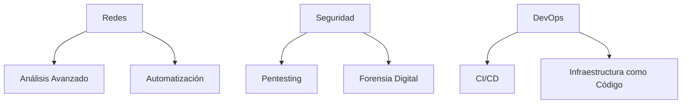

````markdown
# 🐧💻 Linux & Cybersecurity Knowledge Hub   

Repositorio especializado en administración de sistemas Linux, scripting avanzado y técnicas de ciberseguridad.  

---

## 📌 Sobre este Proyecto  

Este repositorio documenta una amplia gama de temas relacionados con:  
- Administración profesional de sistemas Linux.  
- Automatización con Bash scripting.  
- Hacking ético y pruebas de penetración.  
- Creación y personalización de herramientas de seguridad.  
- Laboratorios prácticos para redes y seguridad.  

    

---

## 🚀 Contenido Destacado  

### 🛠️ **Fundamentos Linux**  
```bash
📂 Gestión avanzada de permisos  
🔍 Comandos de análisis de red (tcpdump, nmap)  
⚡ Automatización con cron y systemd  
📦 Gestión de paquetes (apt, dpkg)  
````

### 🧠 **Bash Scripting Avanzado**

```bash
🔄 Scripts para automatización de redes  
🔒 Herramientas de seguridad personalizadas  
📊 Procesamiento avanzado de datos (awk, sed)  
🎨 Scripts con interfaz visual y colorida  
```

### 🔐 **Ciberseguridad Práctica**

```bash
🔎 Metodologías de pentesting  
📡 Análisis de tráfico de red  
🛡️ Hardening de servidores  
🌐 Técnicas OSINT avanzadas  
```

---

## 🧪 Laboratorios & Scripts

|**Herramienta**|**Descripción**|**Última Actualización**|
|---|---|---|
|**[Detector de SO](https://chatgpt.com/c/lab/detector-so)**|Identifica sistemas operativos en red|Enero 2025|
|**[Fuzzing Web](https://chatgpt.com/c/scripts/web-fuzzer)**|Script para descubrir directorios ocultos|Enero 2025|
|**[Auto Backup SSH](https://chatgpt.com/c/tools/ssh-backup)**|Sistema automatizado de copias seguras|Enero 2025|
|**[Analizador de Red](https://chatgpt.com/c/lab/network-analyzer)**|Herramienta para análisis de tráfico de red|Diciembre 2024|

---

## 📅 Historial de Desarrollo

### **2025**

- **Enero**: 🛠️ Suite completa de análisis de red.
- **Diciembre 2024**: 🕵️ Implementación de técnicas OSINT avanzadas.
- **Noviembre 2024**: 📜 Políticas de hacking ético.

### **2024**

- **Octubre**: 🔄 Comparativa metodologías pentesting.
- **Septiembre**: 🏗️ Construcción de laboratorio personal.
- **Julio**: 🐍 Integración de scripts Python para Linux.

---

## 🌟 Roadmap 2025



---

## 🤝 Cómo Contribuir

¡Tu contribución es bienvenida! Sigue estos pasos para colaborar:

1. Clona el repositorio:
    
    ```bash
    git clone https://github.com/je7remy/linuxknowledge.git
    ```
    
2. Crea una nueva rama para tu contribución:
    
    ```bash
    git checkout -b feature/nueva-funcionalidad
    ```
    
3. Realiza tus cambios y crea un commit:
    
    ```bash
    git commit -m "Añadir nueva funcionalidad"
    ```
    
4. Envía un Pull Request con una descripción clara de los cambios realizados.

---

## 📜 Licencia

Este proyecto está bajo licencia [MIT](https://chatgpt.com/c/LICENSE).  
_"El conocimiento es libre, compártelo responsablemente."_

---

[](https://github.com/je7remy/linuxknowledge)  
[](https://www.linux.org/)

```

### Características Clave:
- **Badges dinámicos**: Para actividad, visitas y tecnología.  
- **Bloques de código y tablas**: Destacan secciones clave y scripts importantes.  
- **Diagrama de roadmap**: Representa los objetivos a futuro.  
- **Estilo profesional**: Perfecto para destacar contenido técnico.  

Puedes copiar y pegar este diseño directamente en tu `README.md` y personalizarlo según sea necesario. 🚀
```