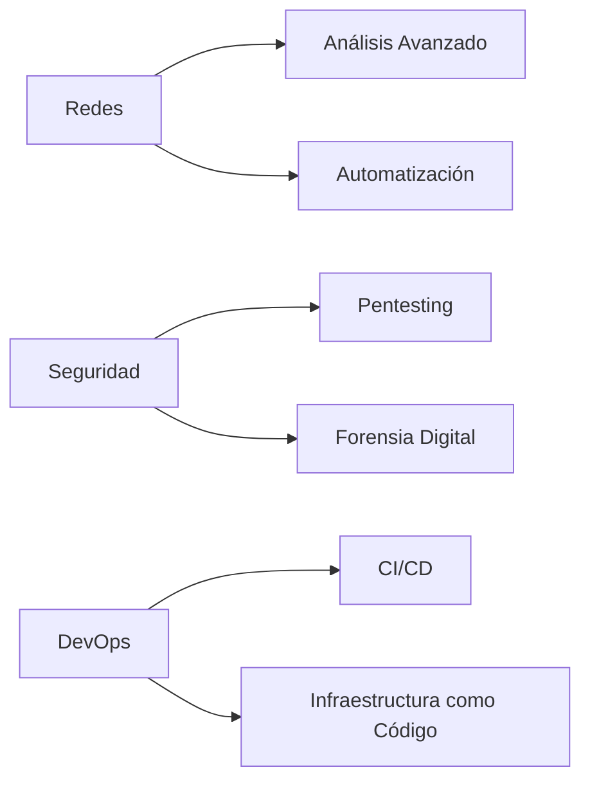

### 🐧💻 **Vault de Obsidian – Linux & Cybersecurity Knowledge Hub**

Bienvenido al **vault definitivo** para administración de sistemas Linux, scripting avanzado y ciberseguridad ofensiva. Este repositorio no es solo documentación: es un **laboratorio práctico** con scripts funcionales, metodologías de hacking ético y automatización de tareas críticas.

---

## 🚀 **¿Qué encontrarás en este vault?**

### 🛠️ **Administración Avanzada de Linux**

📌 Dominio total del sistema: permisos, procesos, usuarios y gestión de paquetes.  
📌 Herramientas esenciales: `tcpdump`, `nmap`, `Wireshark`, `systemctl`, `cron`.  
📌 Automatización de servidores y despliegues eficientes.

### 🧠 **Bash Scripting de Alto Nivel**

📌 Scripts para hacking y auditoría de seguridad.  
📌 Automatización de tareas en servidores y redes.  
📌 Procesamiento avanzado de datos con `awk`, `sed`, y expresiones regulares.

### 🔐 **Ciberseguridad y Pentesting Real**

📌 **Metodologías ofensivas**: reconocimiento, explotación y post-explotación.  
📌 **Análisis de tráfico**: detección de intrusos, sniffing y MITM.  
📌 **Hardening de sistemas**: seguridad en SSH, firewalls y permisos avanzados.  
📌 **OSINT avanzado**: inteligencia en fuentes abiertas y footprinting.

### 🧪 **Laboratorios y Scripts en Acción**

⚡ **Detector de Sistemas Operativos** – Identifica SO en redes locales.  
⚡ **Fuzzing Web** – Encuentra directorios ocultos con Bash.  
⚡ **Auto Backup SSH** – Automatiza copias de seguridad en servidores remotos.  
⚡ **Analizador de Red** – Captura y analiza tráfico con Bash.

---

## 🏗️ **Evolución y Roadmap 2025**

🔹 **Próximos objetivos:**  
✅ Desarrollo de herramientas de seguridad con Bash y Python.  
✅ Expansión de módulos de análisis forense.  
✅ Mejoras en la automatización de auditorías.

---

## 📂 **¿Cómo usar este vault en Obsidian?**

1️⃣ **Descarga el repositorio** desde [GitHub](https://github.com/je7remy/linuxknowledge).  
2️⃣ **Abre Obsidian** y selecciona la carpeta del vault.  
3️⃣ **Explora la documentación interconectada** y accede a scripts, tutoriales y laboratorios en segundos.

🔥 **No es solo conocimiento. Es práctica.** Cada archivo dentro de este vault es una pieza de código, una metodología o un experimento listo para ejecutarse.

🚀 **Empieza ahora. Hackea, automatiza y domina Linux.**